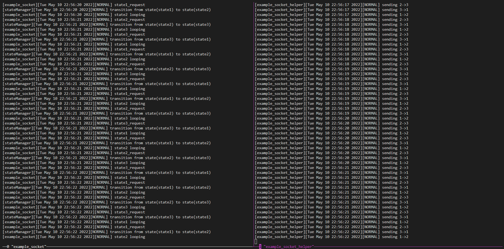

# Simple state machine

During my first formal internship, I had read tons of codes of the company. Among all these codes, the most impressive one was the state machine. After I left my company, I always wanna build a simple state machine library of my own which could be used when needed.

## design patterns

### components

1. states
    <!-- the build blocks of the program -->
    - basic state
        *BasicState* is the basic of the state, all state involved in the system must inherit it and complete all necessary functions.
    - inside one state
        the *void inside_loop_func(void)* is the function the system would consistently running once it in the state.
    - between states
        - the *register_transistion_func(BasicState\* from_state, BasicState\* to_state, uint32_t priority, bool (\*transit()))* is the function connecting two states specifying the priority. the priority would be useful when one state could be transferred to multiple other state. in this case, the priority would determine which state the from_state could be changed to.
        - the *unregister_transistion_func(BasicState\* from_state, BasicState\* to_state)* would then remove the transition between two states.
        - at most one *transition_func* is allowed from exatcly same one state to another state. if multiple *transition_func* is set, the one set lastest would remain
    - state manager
        to make sure the system running correctly, we need to have a manager to trace all the status of the system

2. inputs
    <!-- how system detect the input to change its state -->
    when making decision to whether to change from current state to another one, we need some necessary to make desicion. to make that much easier, pub/sub pattern will be used. that is, we will register our program as a subscriber with the aid of zmq, and all this program do is simply parse the message captured. if this feature is not necessary needed by you, you can disable it by turning off the USE_ZMQ flag.

3. monitor/outputs
    <!--  how others outside the system could find the state of the current system -->

4. configure
    <!--  how the program could start up with required settings -->
    read json file to change the settings of the program

## usage

### running in local environment

the basic usage could be found in the `example/` folder, which include two sets of examples, one using built-in zmq function in the stateManger while another one use socket instead of zmq.

---

for `example_zmq` and `example_zmq_helper`, it use the built-in zmq function. it require libs including zmqpp, zmq, sodium.
running the following command to build them, notice the `example_zmq_helper` will be built in `example` folder.
```bash
mkdir build
cd build
cmake .. -DUSE_ZMQPP=ON -DBUILD_EXAMPLE=ON
cmake --build .
```


---

for `example_socket` and `example_socket_helper`, it does not use the built-in zmq function and it use socket instead.
**Notice**: due to the design of `example_socket`, run `example_socket_helper` before `example_socket`. also, this is just a simple socket connection for illustration, as long as one end disconnected, the whole system would then stopped. to make stateManager could deconstructed correctly, further operations are needed.
running the following command to build them, notice the `example_socket_helper` will be built in `example` folder.
```bash
mkdir build
cd build
cmake .. -DUSE_ZMQPP=OFF -DBUILD_EXAMPLE=ON
cmake --build .
```


### running in docker environment

to make running the program easier, an extra docker is provided, to pull that docker just run `docker pull xueshengst/simplestateenv`, and enter `/usr/app` folder, where the program is placed.

if you want to modify the docker environment, the original Dockerfile is provided in the `docker` folder, and you can run `docker build -t your_docker_id/your_image_name .` to build it, make sure replace `your_docker_id` and `your_image_name` with the proper name.

## current process

### implementation
- [x] desgin
- [x] functions
  - [x] basic functions (where zmq is mandatory)
  - [x] disable zmq using flag

### build & install
- [x] build
- [x] install

### docker env
- [x] docker env

## special thanks

thanks to 
  - [zmq](https://zeromq.org/) for powerful sub/pub function
  - [nlohmann/json](https://github.com/nlohmann/json) for handy json function
